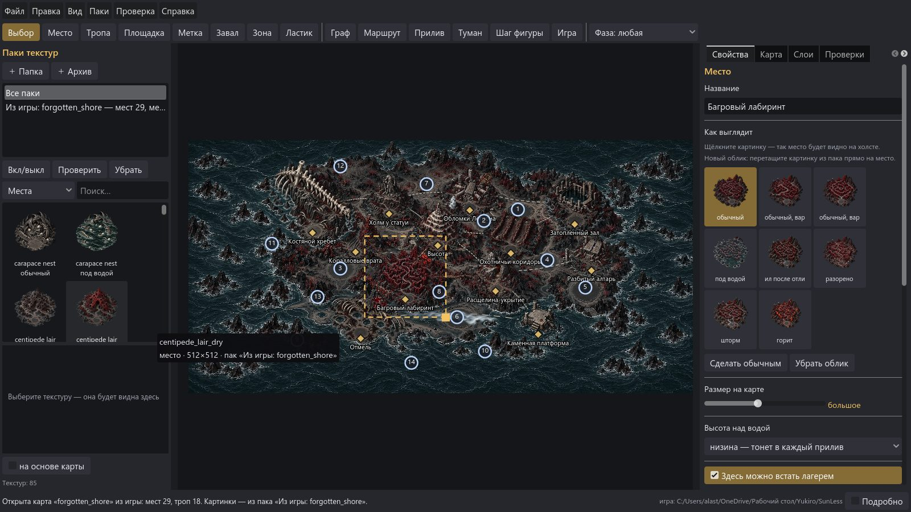
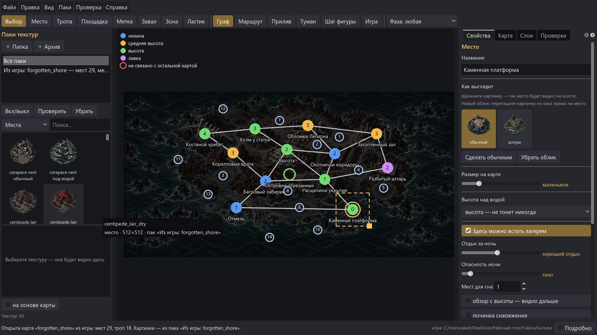
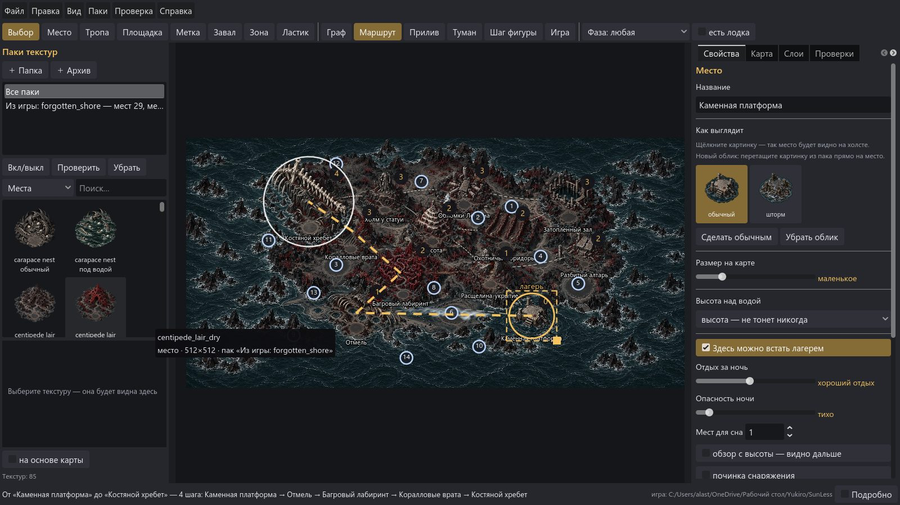
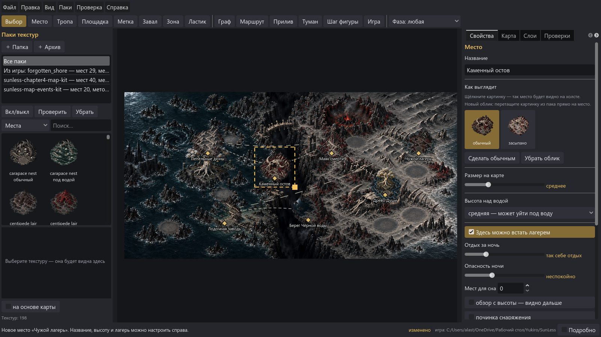
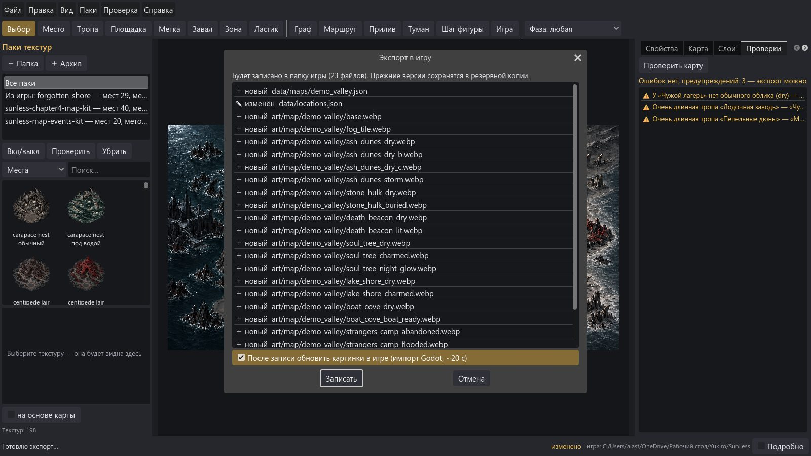

# Редактор карт SunLess

Программа для сборки карт глав игры SunLess (Godot 4.7, фанатская некоммерческая игра по «Shadow Slave»)
из подключаемых паков текстур — мышью, с проверками как в игре и экспортом в файлы, которые игра читает без правки кода.

Работа идёт по фазам — см. [docs/PLAN.md](docs/PLAN.md).

## Запуск

Нужен Godot 4.7.2 (тот же, что у игры).

```bash
godot --path .                                         # окно редактора
godot --headless --path . -s res://tests/run_tests.gd  # тесты
```

Папка игры для тестов на настоящих картах — переменная `SUNLESS_GAME` или соседняя папка `../SunLess`.

## Что уже умеет (фаза 2 — окно, MVP)

- **Паки текстур** слева: папки и .zip, авто-описание по папкам и именам, проверка пака, поиск, миниатюры; перетаскивание на холст.
- **Холст**: основа, места (виньетки), тропы пунктиром как в игре, площадки, точки значков событий; масштаб колесом, сдвиг средней кнопкой или пробелом.
- **Инструменты**: Выбор (V), Место (P), Тропа (T), Площадка (S), Метка (D), Завал (R), Зона (Z), Ластик (E); Ctrl+Z / Ctrl+Y.
- **Свойства места словами**: название, облики картинками, размер ползунком («маленькое… огромное»), высота над водой, лагерь («тихо… очень опасно»), появляющееся место.
- **Режимы**: «Граф» (связность и высоты), «Маршрут» (шаги и путь как в игре), «Прилив», «Туман», «Шаг фигуры».
- **Проверки** как в игре (F7) — щелчок по строке показывает место. **Экспорт** (Ctrl+E) — список изменений, резервные копии, только изменённое.
- Открытие карты из игры («Файл → Открыть карту из игры»), проект `.mapproj`, автосохранение раз в 2 минуты.







## Агентский интерфейс (фаза 3, методика CLI-Anything)

`agent-harness/` — пакет `cli-anything-sunless-map` по методике [CLI-Anything](https://github.com/HKUDS/CLI-Anything):
команды с `--json`, REPL, отмена/повтор, предпросмотр `preview-bundle/v1`. Бэкенд — сам редактор без окна (`cli/cli.gd`),
поэтому правила у агента и в окне одни и те же. Skill для Claude Code — `skills/cli-anything-sunless-map/SKILL.md`
(и копия в `.claude/skills/`).

```bash
pip install -e agent-harness[test]
cli-anything-sunless-map --json project open-game --region forgotten_shore -o shore.mapproj
cli-anything-sunless-map -p shore.mapproj route "Каменная платформа" "Костяной хребет"
cli-anything-sunless-map -p shore.mapproj preview capture --recipe overview
```

Файлы `utils/repl_skin.py` и `utils/preview_bundle.py` взяты из CLI-Anything (Apache 2.0, см. `agent-harness/LICENSE-CLI-ANYTHING`).
