# Примеры: новые карты из доступных текстур

Три новые карты глав, собранные редактором из комплектов игры (`SunLess/docs/assets/kits`). Собраны агентским
интерфейсом (`build_examples.py` → `cli-anything-sunless-map batch`), все проходят проверки игры без ошибок,
и **каждую нарисовала сама игра** (`game-shot` — временный регион, после снимка папка игры возвращена как была).

Открыть в редакторе: «Файл → Открыть проект…» → `examples/<карта>.mapproj` (пути к пакам и игре — как на машине автора).
Пересобрать: `python examples/build_examples.py [ash_pass|night_shore|gate_town]`. Операции каждой карты — `ops/<карта>.json`.

## 1. Пепельный перевал (`ash_pass`) — 15 мест

Основа Пути Пепла (комплект Главы 4) и места из двух паков: Главы 4 и событий Берега (Чужой лагерь стал
«Перевальным лагерем», Упавшая звезда, Спящий голем). Хрупкий мост над Бездной (рушится после 4 переходов и в бурю),
опасный спуск «Тропа Демона — Край Бездны», зона «Гнев Владыки Пепла» (ночью — на шаг, в Кровавую луну — на два),
Демон-следопыт идёт к лагерю, облики по фазам (Древо светится ночью, Владыка в гневе), маяк горит ночью, полосы
пепельной бури.

| Редактор | Граф | Как у игрока | Нарисовано игрой |
|---|---|---|---|
| 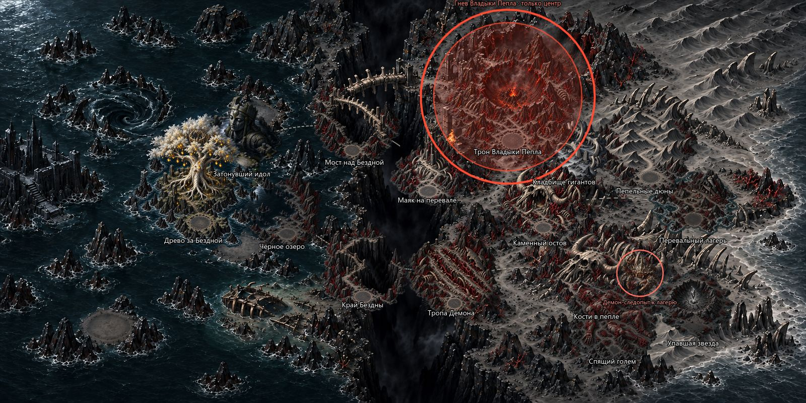 | 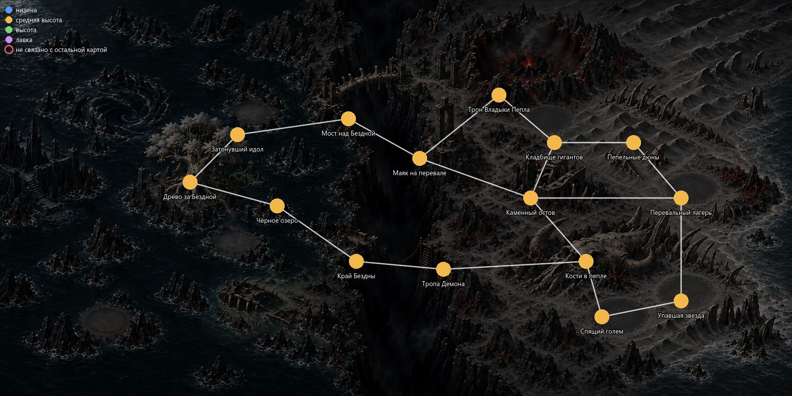 | 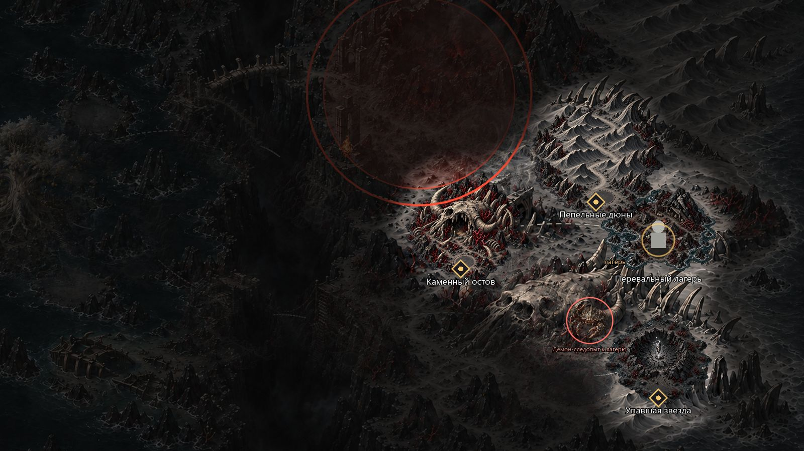 | 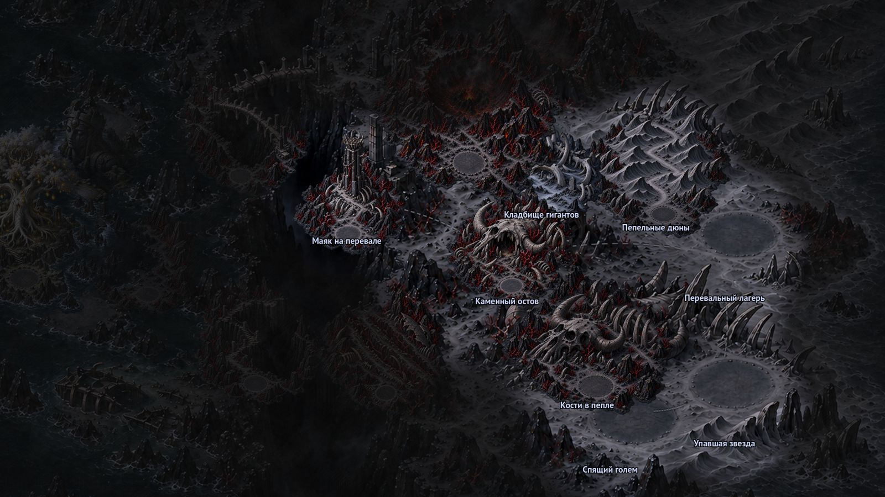 |

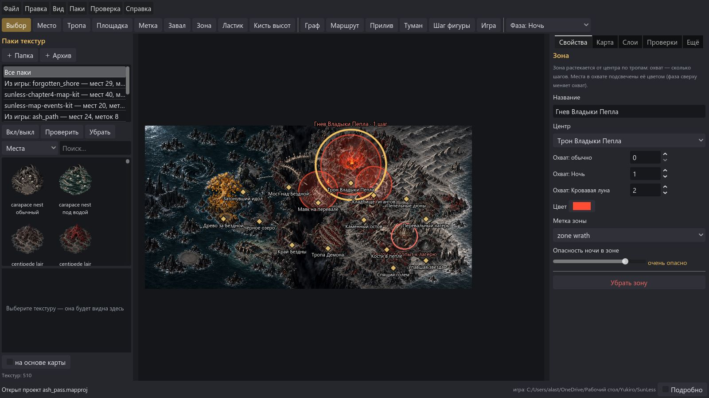

## 2. Ночной Берег (`night_shore`) — 14 мест + 2 появляющихся

Карта с водой и приливом: основа, карта высот и плитки воды и тумана из комплекта Берега. Новый граф и новые роли мест,
сухой хребет из пяти высот (в любой прилив от любой высоты дойти до любой другой), Туша исполина, Колодец Легиона и Гнездо
посланника из пака событий стали постоянными местами; Утонувшая башня и Поле раковин появляются на четырёх площадках отлива.
Кровавая луна: лабиринт горит, на Ночном дозоре — маяк, кровь на отмели, отражение луны у Туши, багровая дымка.

| Редактор | Граф | Как у игрока | Нарисовано игрой |
|---|---|---|---|
| 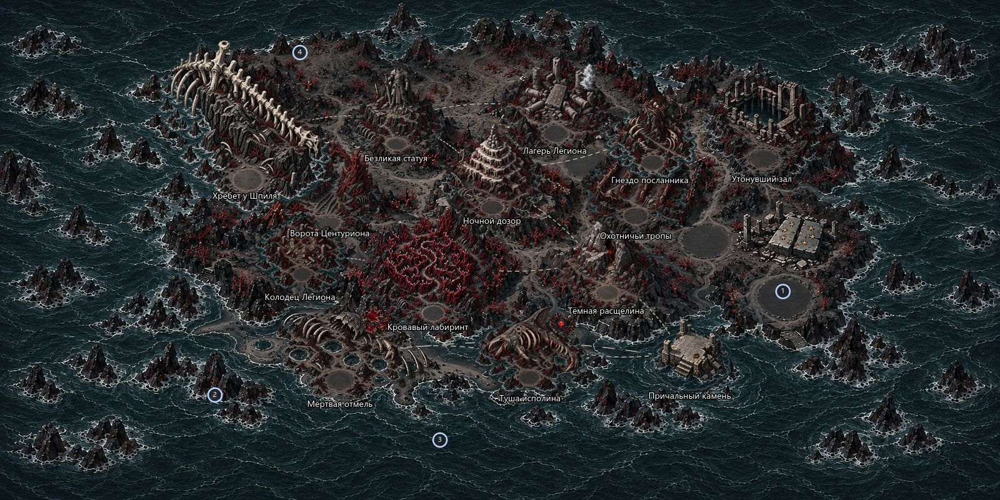 | 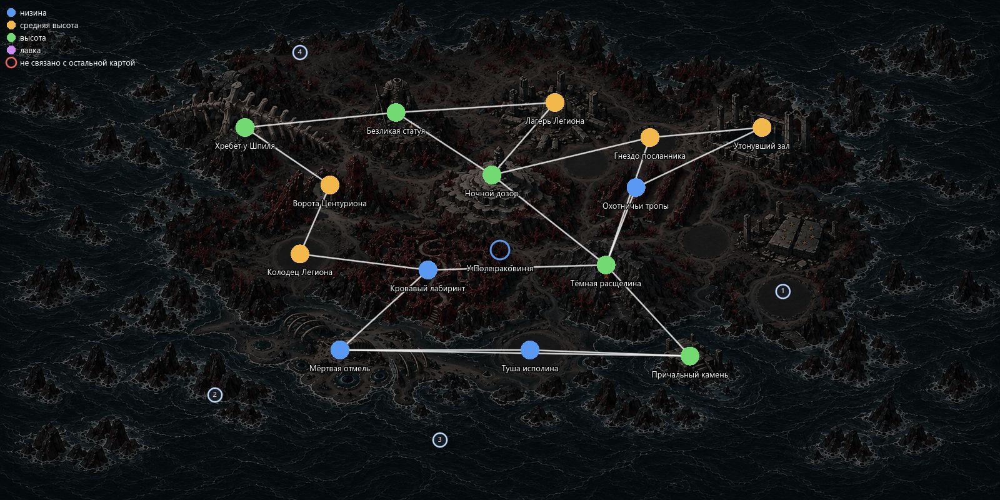 | 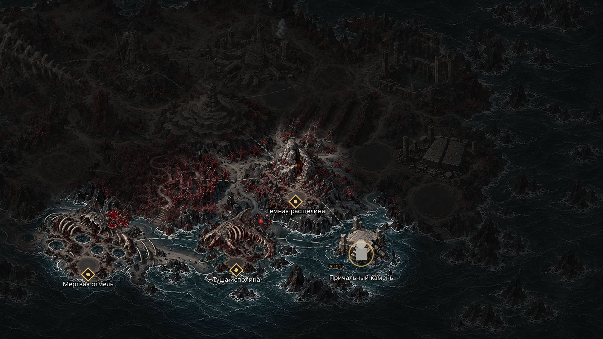 | 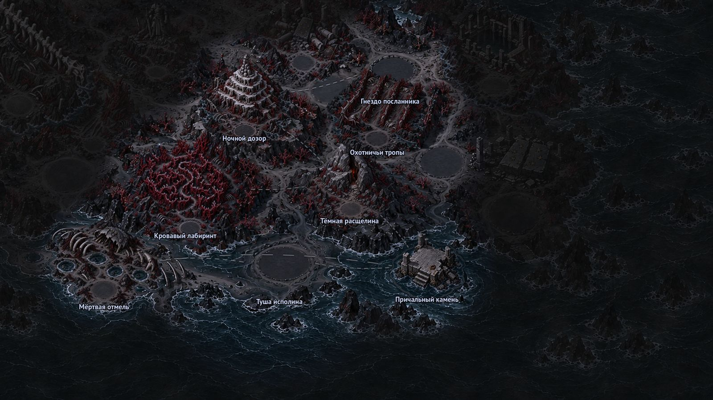 |

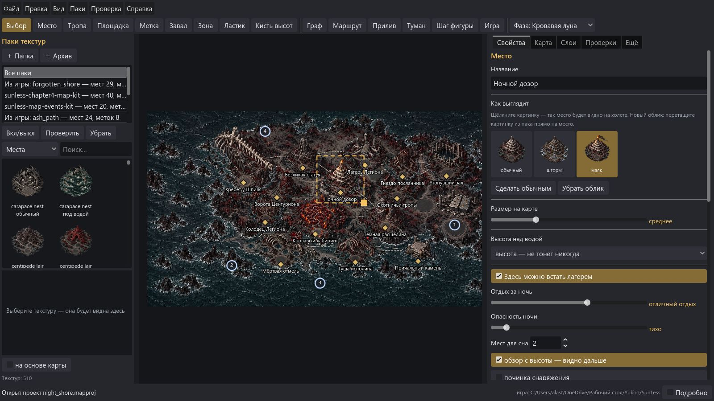

## 3. Город у Врат (`gate_town`) — 11 мест

«Собрать мир»: основа кампуса Академии, а места — кварталы Города людей (комплект `real-city-map-kit`): Убежище, Рынок,
Полевой госпиталь, Совет города, Мастерские, Станция монорельса, Спуск в подземку, Заросший парк, Дорога к Академии,
Пролом в стене. Ночью стена прорвана, на рынке тревога; полоса трещин на дороге от пролома, лагеря с разными службами.

| Редактор | Граф | Как у игрока | Нарисовано игрой |
|---|---|---|---|
| 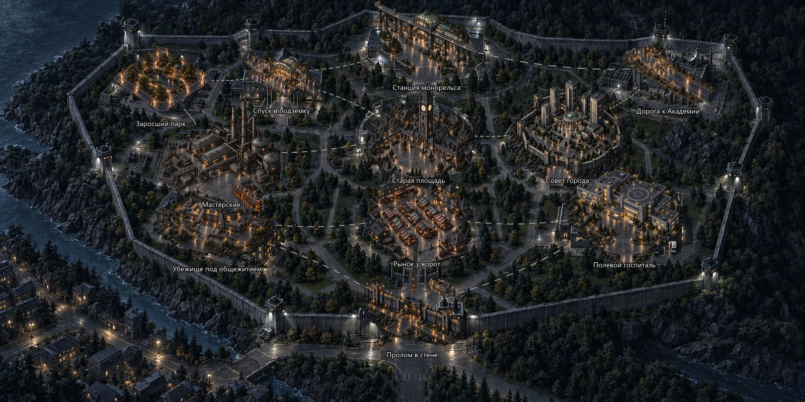 | 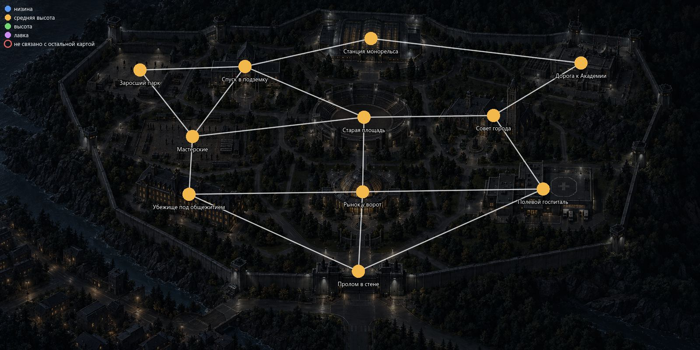 | 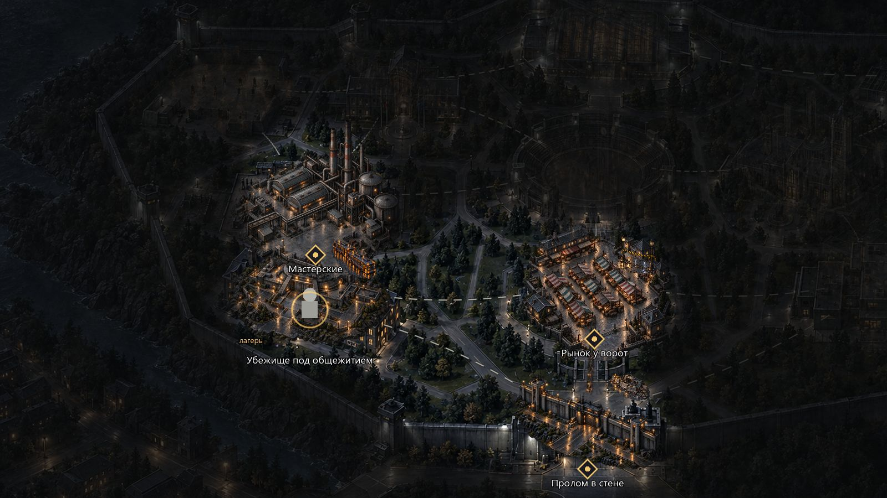 | 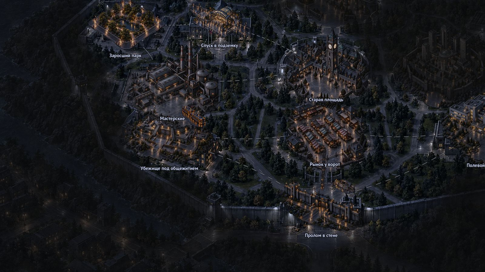 |

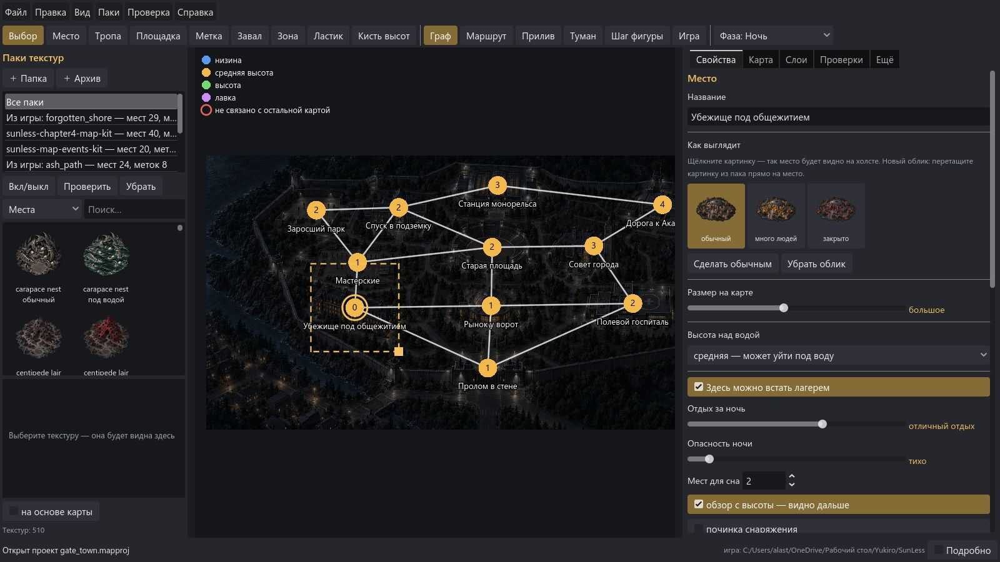

## Что осталось предупреждениями (экспорт разрешён)

- Места из пака событий Берега не имеют облика `dry` — у них свой облик по умолчанию (например, «занято» у лагеря).
- Наложение виньеток там, где места стоят на соседних площадках основы (как и на исходных картах игры).
